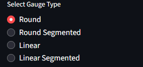

Custom Gauge Image Generator and ICL Optimizer
A Streamlit-based toolkit that lets you create richly styled gauge charts (round or linear, continuous or segmented) with live D3.js preview and one-click PNG export, plus an ICL memory-block file allocator. Perfect for embedded-GUI prototyping and flash-image planning.


# Custom Gauge Image Generator & ICL Optimizer — User Manual

---

## 1. Prerequisites

Before using this application, ensure you have:

- **Python 3.8+**  
- **pip** (Python package installer)

Required Python libraries (install all at once):
```bash
pip install streamlit matplotlib numpy python-docx


## 2. Introduction & App Overview

This tool accelerates GUI development for **DWIN HMI** displays (https://www.dwin-global.com). It provides:

- Live D3.js gauge previews  
- One-click export of single or batch (0–99) PNG gauges  
- ICL flash-block optimization for `.icl` modules  

### Main Interface  


---

## 3. Gauge Generator Tab

_Select **Gauge Generator** to design and export your gauges._

### 3.1 Navigation  


### 3.2 Live Preview Controls

- **Gauge Type**  
    
  Options: Round, Round Segmented, Linear, Linear Segmented  

- **Gauge Value**  
    
  Range 0–99  

### 3.3 Export Buttons  
  
- Download Current Gauge (single PNG)  
- Generate and Download All Gauges (0–99) (ZIP)  

### 3.4 Size Inputs  
  
Set **Output Width/Height (px)** for your PNG.

### 3.5 Colors & 3D Effect  
  
Pick Active/Inactive/Background colors and toggle 3D lighting.

### 3.6 Specific Gauge Settings  
  
- **Round Gauges**: thickness, start/end angle, fill direction, debug markers, tip style, segments & gaps  
- **Linear Gauges**: thickness, orientation, tip style, segments & gaps  

### 3.7 Labels & Name  
  
Toggle numeric value and custom name overlays; pick their colors.

### 3.8 Live Preview Output  
The central pane shows the D3.js–rendered gauge exactly as it will export.  
*(See “Main Interface” screenshot above.)*

---

## 4. ICL Optimizer Tab

_Select **ICL Optimizer** to pack `.icl` modules into contiguous flash-block ranges._

### 4.1 Upload ICL Files  
  
Drag & drop or click **Browse Files**, then set **Start Block** and **End Block**.

### 4.2 Original Address Allocation Check  
  
Review file name, size (KB), blocks used, original start/end, and status (Valid vs. error).

### 4.3 Optimized (Non-Overlapping) Packing Proposal  
  
See recomputed start/end and new filenames (prefixed by block).  
Click **Download Renamed ZIP** to grab all optimized modules.

### 4.4 Block Allocation Map  
/[images](https://github.com/gcharles81/DWIN-Guage-creator/tree/main/images)
/block_allocation_map.png)  
Color key: gray = free, blue = occupied, red = overlap/out-of-range.

---

## 5. Tips & Troubleshooting

- Keep **Show Value/Name** OFF for Linear gauges.  
- For very large exports (>600 px), live preview may slow (exports unaffected).  
- Ensure your `.icl` filenames match intended start-block numbers for predictable packing.

Download Gauges
Click “Download Current Gauge” or “Generate and Download All Gauges (0–99)”.

ICL Optimizer Tab
Upload your .icl files, set block range, review original vs. optimized allocation, then download the renamed ZIP.
